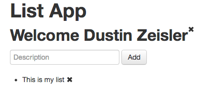
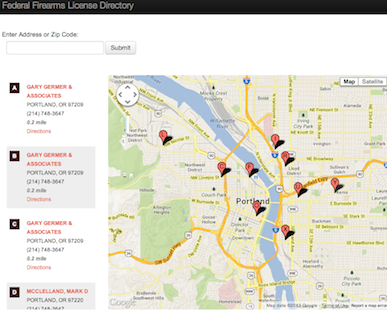
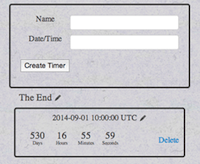

* [Visualize Ruby](#visualize_ruby)
* [ActiveMocker](#active-mocker)
* [Dissociated Introspection](#dissociated-introspection)
* [Active Enumerable](#active-enumerable)
* [Reverse Parameters](#reverse-parameters)
* [Thread Inheritable Attributes](#thread-inheritable-attributes)
* [Voice Chapters](#voice-chapetrs)
* [Credit Card Processor](#credit-card-processor)
* [Scrabble/JavaScript](#scrabble-in-javascript)
* [Scrabble/Sinatra](#scrabble-in-sinatra)
* [Critic Matcher](#critic_matcher)
* [Todo List/Angularjs](#todo-list-in-angularjs)
* [Toggle Cells](#toggle-cells)
* [Geo-location search](#geolocation-search)
* [Timer App](#timer-app)

# Visualize Ruby

* [Demo](https://visualize.dustinzeisler.com)
* [Github](https://github.com/zeisler/visualize_ruby)
* Post: [Visualize Ruby Execution](https://dustinzeisler.com/ruby/2018/08/07/visualize-ruby-execution.html)

# Active Mocker

* [Github](https://github.com/zeisler/active_mocker)
* Post: [Why use ActiveMocker]({{ site.baseurl }})

Creates stub classes from any ActiveRecord model.

By using stubs in your tests you don't need to load Rails or the database, sometimes resulting in a 10x speed improvement.

ActiveMocker analyzes the methods and database columns to generate a Ruby class file.

The stub file can be run standalone and comes included with many useful parts of ActiveRecord.

Stubbed out methods contain their original argument signatures or ActiveMocker friendly code can be brought over in its entirety.

Mocks are regenerated when the schema is modified so your mocks won't go stale, preventing the case where your unit tests pass but production code fails.

# Dissociated Introspection
 [Github](https://github.com/zeisler/dissociated_introspection)
 
Introspect methods, parameters, class macros, and constants without loading a parent class or any other dependencies.
 
# Active Enumerable
 * [Github](https://github.com/zeisler/active_enumerable)
 
ActiveRecord like query methods for Ruby enumerable collections.
 
# Reverse Parameters
 * [Github](https://github.com/zeisler/reverse_parameters)
 
Dynamically recreate ruby method signatures.
 
 
# Thread Inheritable Attributes
 * [Github](https://github.com/zeisler/thread-inheritable_attributes)
 
Passes thread variables to child-spawned threads.

# Voice Chapters

[Github](https://github.com/zeisler/voice_chapters)

Using the Mac system text-to-speech Voice Chapters will create an audio file with bookmarked chapters. It takes a regex capture group to define the chapter markers and the gem will create a m4a/acc file.

# Credit Card Processor

[Github](https://github.com/zeisler/credit_card_processor)

Basic credit card processing cli application. Takes input from stdin or from file. Validates card numbers via Luhn. Designed at the core with immutable entities.

# Scrabble in JavaScript

[Github](https://github.com/zeisler/scrabble)

* Includes test suite in Jasmine Specs
* Has a pluggable interface for game play
* Designed in CoffeeScript

#Scrabble in Sinatra

[Github](https://github.com/zeisler/sinatra-scrabble) -
[Demo](https://scrabble.dustinzeisler.com)

This is the initial proof of concept of an online Scrabble game. The backend code is written in Ruby and Sinatra for the web view.
[..more](/2013/07/08/scrabble.html)
* Dragable tiles, interactive, dynamic
* Sinatra/ruby
* MiniSpec (Testing)
* js/Coffee
* jQuery/UI
* Mobile touch events
* Twitter Bootstrap

# Critic Matcher

[Github](https://github.com/ShaneDelmore/critic_critic) -
[Demo](http://critic-critic.herokuapp.com/)

Rate movies and find critics that agree with your taste. This project pulls in Critic data from Rotten Tomato's API runs it through a ruby wrapper and into a Postgres DB.
[..more](http://localhost:4000/2013/07/05/critic-matcher.html)
* Team Project
* Rails/ruby
* API to RottenTomatoes
* Responsive Design
* MiniSpec (Testing)

# Todo List in Angularjs
[Github](https://github.com/zeisler/list)

App saves user name and can save and delete list items. The data is persisted on client browser, on refresh the data is still available.

* Data is persisted in HTML5 localstorage
* All page interaction is Real time, no page refresh

# Toggle Cells

[Demo](http://dustinzeisler.com/ToggleCells/) -
[Github](https://github.com/ShaneDelmore/ToggleCells)

* Pairing Project
* Interactive Game
* js/coffee
* Jasmine (Testing)

# Geo-location search

[Demo](http://ffl-locator.herokuapp.com) -
[Github](https://github.com/zeisler/ffl_locator)

Provides a Google maps search of nearest FFL government data.
[..more](/2013/08/07/Geo-location-Google-maps.html)
* Google maps
* Json
* Rails
* Postgres

# Timer App

[Github](https://github.com/zeisler/timer) -
 [Demo](http://serene-sands-7788.herokuapp.com/)

 The app is a one page app is use the [best in place gem](https://github.com/bernat/best_in_place) to edit the timer once its is created. To select the date and time I am using the jQuery UI [Date & Time picker ui](http://trentrichardson.com/examples/timepicker/).
 [..more](/2013/03/19/timer-app.html)
* Rails/ruby
* Ajax
* jQuery/UI

