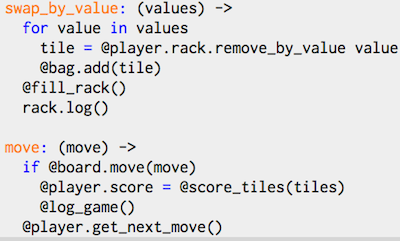
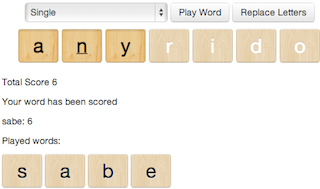
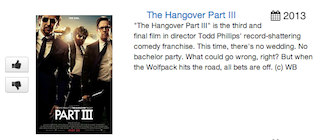
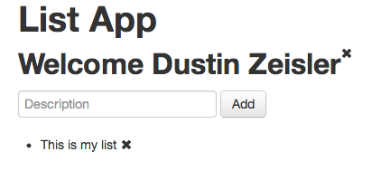
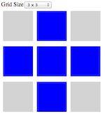
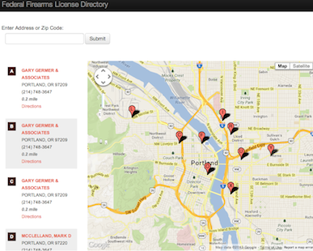
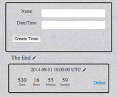

* [ActiveMocker](#active-mocker)
* [Voice Chapters](#voice-chapetrs)
* [Credit Card Processor](#credit-card-processor)
* [Scrabble/JavaScript](#scrabble-in-javascript)
* [Scrabble/Sinatra](#scrabble-in-sinatra)
* [Critic Matcher](#critic_matcher)
* [Todo List/Angularjs](#todo-list-in-angularjs)
* [Toggle Cells](#toggle-cells)
* [Geo-location search](#geolocation-search)
* [Timer App](#timer-app)

# Active Mocker

[Github](https://github.com/zeisler/active_mocker)

Creates mocks classes from ActiveRecord models. Allowing your test suite to run very fast by not loading Rails a database. It parses the schema.rb and the defined methods on a model then generates a ruby file that can be included within a test. The mock file can be run by themselves and come with a partial implementation of ActiveRecord. Attributes and associations can be used just the same as in ActiveRecord. Methods will have the correct arguments but raise an NotImplementedError when called. Mocks are regenerated when the schema is modified so your mocks will not go stale; preventing the case where your units tests pass but production code fails.

# Voice Chapters

[Github](https://github.com/zeisler/voice_chapters)

Using the Mac system text-to-speech Voice Chapters will create an audio file with bookmarked chapters. It takes a regex capture group to define the chapter markers and the gem will create a m4a/acc file.

# Credit Card Processor

[Github](https://github.com/zeisler/credit_card_processor)

Basic credit card processing cli application. Takes input from stdin or from file. Validates card numbers via Luhn. Designed at the core with immutable entities.

# Scrabble in JavaScript

[Github](https://github.com/zeisler/scrabble)

* Includes test suite in Jasmine Specs
* Has a pluggable interface for game play
* Designed in CoffeeScript

#Scrabble in Sinatra

[Github](https://github.com/zeisler/sinatra-scrabble) -
[Demo](http://scrabble-game.herokuapp.com/)

This is the initial proof of concept of an online Scrabble game. The backend code is written in Ruby and Sinatra for the web view.
[..more](/2013/07/08/scrabble.html)
* Dragable tiles, interactive, dynamic
* Sinatra/ruby
* MiniSpec (Testing)
* js/Coffee
* jQuery/UI
* Mobile touch events
* Twitter Bootstrap

# Critic Matcher

[Github](https://github.com/ShaneDelmore/critic_critic) -
[Demo](http://critic-critic.herokuapp.com/)

Rate movies and find critics that agree with your taste. This project pulls in Critic data from Rotten Tomato's API runs it through a ruby wrapper and into a Postgres DB.
[..more](http://localhost:4000/2013/07/05/critic-matcher.html)
* Team Project
* Rails/ruby
* API to RottenTomatoes
* Responsive Design
* MiniSpec (Testing)

# Todo List in Angularjs
[Github](https://github.com/zeisler/list)

App saves user name and can save and delete list items. The data is persisted on client browser, on refresh the data is still available.

* Data is persisted in HTML5 localstorage
* All page interaction is Real time, no page refresh

# Toggle Cells

[Demo](http://dustinzeisler.com/ToggleCells/) -
[Github](https://github.com/ShaneDelmore/ToggleCells)

* Pairing Project
* Interactive Game
* js/coffee
* Jasmine (Testing)

# Geo-location search

[Demo](http://ffl-locator.herokuapp.com) -
[Github](https://github.com/zeisler/ffl_locator)

Provides a Google maps search of nearest FFL government data.
[..more](/2013/08/07/Geo-location-Google-maps.html)
* Google maps
* Json
* Rails
* Postgres

# Timer App

[Github](https://github.com/zeisler/timer) -
 [Demo](http://serene-sands-7788.herokuapp.com/)

 The app is a one page app is use the [best in place gem](https://github.com/bernat/best_in_place) to edit the timer once its is created. To select the date and time I am using the jQuery UI [Date & Time picker ui](http://trentrichardson.com/examples/timepicker/).
 [..more](/2013/03/19/timer-app.html)
* Rails/ruby
* Ajax
* jQuery/UI

